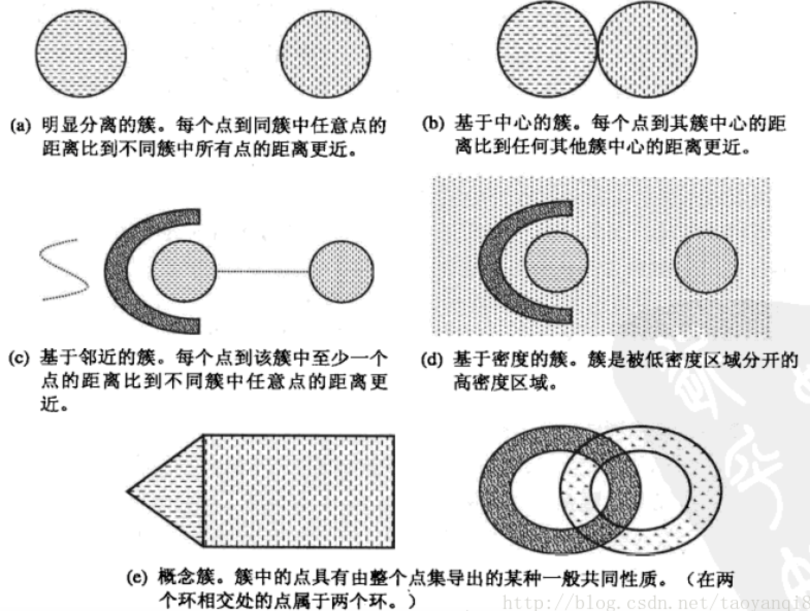

# 1. 概述
**什么是聚类分析**
聚类分析是在数据中发现数据对象之间的关系，将数据进行分组，组内的相似性越大，组间的差别越大，则聚类效果越好。·
**簇的种类**
簇的种类可以分为:
1. 明显分离的
2. 基于原型的
3. 基于图的
4. 基于密度的
5. 共性质的

如下图所示:




*基本的聚类分析算法*
1. K均值：
基于原型的、划分的距离技术，它试图发现用户指定个数(K)的簇。

2. 凝聚的层次距离：
思想是开始时，每个点都作为一个单点簇，然后，重复的合并两个最靠近的簇，直到尝试单个、包含所有点的簇。

3. DBSCAN:
一种基于密度的划分距离的算法，簇的个数有算法自动的确定，低密度中的点被视为噪声而忽略，因此其不产生完全聚类。

# 2. k-means算法

## 2.1 基本的算法流程

k-means算法的流程：
```
选择K个点作为初始质心  
repeat  
    将每个点指派到最近的质心，形成K个簇  
    重新计算每个簇的质心  
until 簇不发生变化或达到最大迭代次数  
```

## 2.2 如何进行调优
k-means算法的优缺点：
- 优点: 复杂度接近线性O(NKt),N样本数,K距离中心个数，t轮数
- 缺点: 1.受初始值和离群点影响，每次结果不稳定，2.通常是局部最优解，3.需要选择簇的个数，4.样本只能被划分为单一的类。

**k-means调优思路:**

1. 数据归一化和离群点处理
   k均值算法是一种基于欧式距离的数据划分算法，均值和方差较大的维度对数据的聚类结果产生决定性的影响，因此需要进行归一化，离群点或少量的噪声会对均值产生较大影响，影响簇中心的计算，因此在使用算法前应该进行预处理
2. 合理的选择k值
   - a. 通过求损失函数的拐点(sse,均方根误差)，通过实验不同的k值，求出sse值，当sse明显的下降变缓，即有一个明显的拐点，则为最佳的k值

   - b. gap statistic方法 
     通过求解 $gap(k) = E(logD_k) - logD_k$的最大值
     $E(logD_k)$是使用蒙特卡洛模拟产生的损失值的期望。
3. 采用核函数
   传统欧式距离方法，使得k均值假设各个簇的数据呈球形或高维的球形分布，在实际中不常见，对于非凸数据，可以使用核函数进行优化。

## 2.3 针对k-means算法,有哪些改进的模型


# 参考资料
- 数据挖掘导论
- 百面机器学习