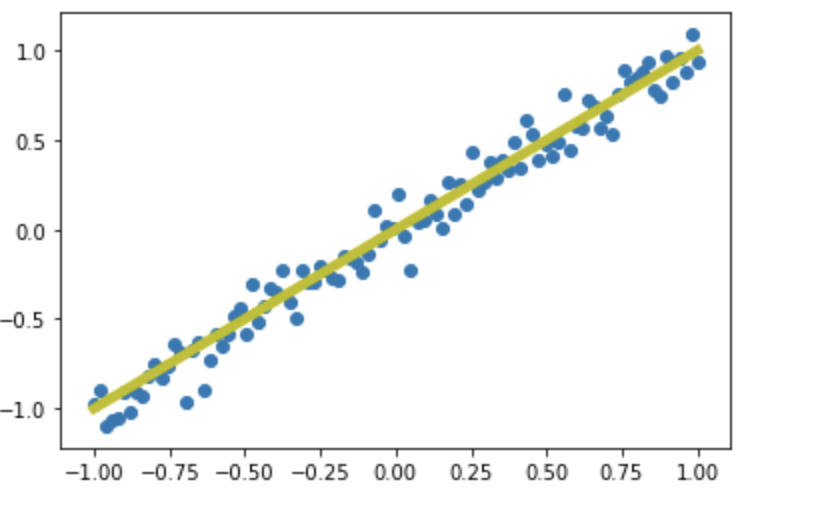

# 概述
当我们进行特征工程后，有时候会产生高维的特征空间，其中包含很多的冗余的数据，给训练带来困难，因此需要通过降维方法提升特征的表达能力，降低训练的复杂度。
**为什么需要降维**

1. 随着数据维度不断降低，数据存储所需的空间也会随之减少。
2. 低维数据有助于减少计算/训练用时。
3. 一些算法在高维度数据上容易表现不佳，降维可提高算法可用性。
4. 降维可以用删除冗余特征解决多重共线性问题。比如我们有两个变量：“一段时间内在跑步机上的耗时”和“卡路里消耗量”。这两个变量高度相关，在跑步机上花的时间越长，燃烧的卡路里自然就越多。因此，同时存储这两个数据意义不大，只需一个就够了。
5. 降维有助于数据可视化。如前所述，如果数据维度很高，可视化会变得相当困难，而绘制二维三维数据的图表非常简单。

## 主成分分析(principal components analysis)
主成分分析在于找到数据中的**主成分**代替原始数据，从而达到降维的目的。
如下图是一个二维的空间中，蓝色为原始的数据分布，数据是经过去中心化的，其主成分是y=x的线段，在此黄线上，数据的分布更为分散，意味着**数据在这个方向上的方差较大**。

&emsp;在信号处理领域，信号具有较大的方差，噪声具有较小的方差，信号与噪声的比为信噪比，信噪比越大意味着数据的质量越好，因此PCA的模板是最大化投影方差。

**最大化投影方差**经过证明可能其实：协方差矩阵最大的特征向量值，最佳的投影方向就是最大特征值所对应的特征向量。证明如下：

去中心化的数据$x_1, x_2, ... x_m$，其中$x_i$是列向量，维度为数据的特征数n,向量的投影方向$w$,则$x_i$的投影坐标为$x_i^T.w$,因此投影坐标后的方差:

# 参考资料
- [12种降维方法终极指南（含Python代码）](https://zhuanlan.zhihu.com/p/43225794)