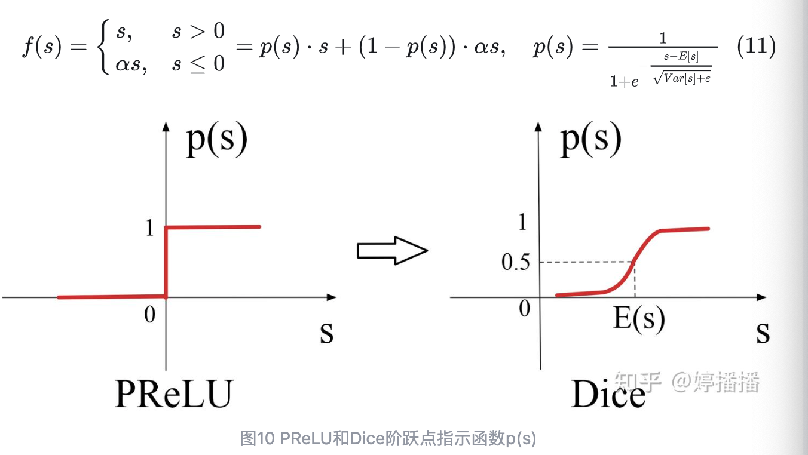

- [激活函数总结](#激活函数总结)
  - [1.为什么需要激活函数](#1为什么需要激活函数)
  - [2.Sigmoid](#2sigmoid)
  - [3.Tanh](#3tanh)
  - [4.ReLU系列](#4relu系列)
    - [4.1 ReLU](#41-relu)
    - [4.2 Leaky ReLU](#42-leaky-relu)
    - [4.3 PReLU](#43-prelu)
    - [4.4 Dice](#44-dice)
  - [5. softmax](#5-softmax)
- [参考资料](#参考资料)

# 激活函数总结

## 1.为什么需要激活函数
非线性

## 2.Sigmoid

$$f(x) = \frac{1}{1+e^{-x}}$$

优点:
- 处处可导
- 输出范围 $[0,1]$ , 概率
缺点:
- 梯度消失, x取值很大或很小
- 梯度很小，连乘后梯度小时
- 非对称
- 包含指数运算，效率低下

## 3.Tanh
$$f(x) = \frac{e^x-e^{-x}}{e^x+e^{-x}}$$
优缺点基本和sigmoid一样

## 4.ReLU系列

### 4.1 ReLU
$$f(x) = max(0,x)$$
优点:
- 1)输入>0时保持梯度为恒定值不衰减，从而缓解梯度消失问题；(2) 输入<0时导数为0，当神经元激活值为负值时，梯度不再更新，增加了网络的稀疏性，从而使模型更具鲁棒性，这点类似dropout但不完全等同dropout；(3) 计算速度快，ReLU函数的导数是if-else的实现逻辑，计算非常方便快速。
缺点:
- <0 时，直接为0

### 4.2 Leaky ReLU
$$f(x) = max(\alpha x,x)$$

### 4.3 PReLU
Leaky ReLU函数中引入了参数 
 ，存在依赖人工调整的缺陷，针对此，PReLU(Parametric ReLU)采用把 
 当成神经元的一个参数的思路，通过网络学习得到，从而使其不依赖于人工。

PReLU的定义和函数图像跟Leaky ReLU相同，如式子(8)和图8所示，其特点也和Leaky ReLU相同。不同的是，PReLU通过网络自身学习参数\alpha，使其和当前场景的数据更适配。

### 4.4 Dice

## 5. softmax
$$f(x) = \frac{e^x}{\sum_i{e^x_i}}$$

# 参考资料

- [深入理解深度学习中常见激活函数](https://zhuanlan.zhihu.com/p/508119920)