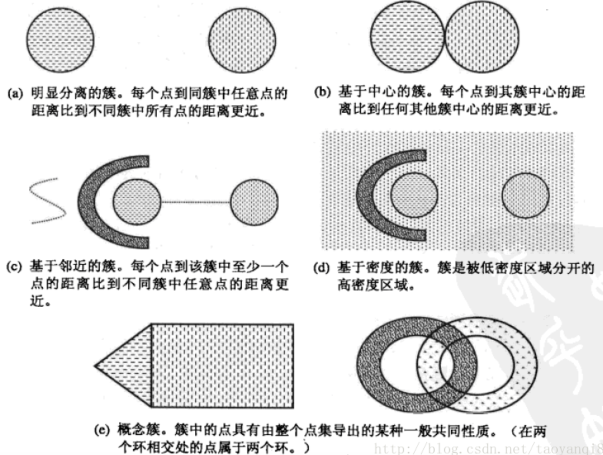

- [1. 概述](#1-%e6%a6%82%e8%bf%b0)
- [2. k-means算法](#2-k-means%e7%ae%97%e6%b3%95)
  - [2.1 基本的算法流程](#21-%e5%9f%ba%e6%9c%ac%e7%9a%84%e7%ae%97%e6%b3%95%e6%b5%81%e7%a8%8b)
  - [2.2 如何进行调优](#22-%e5%a6%82%e4%bd%95%e8%bf%9b%e8%a1%8c%e8%b0%83%e4%bc%98)
  - [2.3 针对k-means算法,有哪些改进的模型](#23-%e9%92%88%e5%af%b9k-means%e7%ae%97%e6%b3%95%e6%9c%89%e5%93%aa%e4%ba%9b%e6%94%b9%e8%bf%9b%e7%9a%84%e6%a8%a1%e5%9e%8b)
- [3. DBSCAN算法](#3-dbscan%e7%ae%97%e6%b3%95)
  - [3.1 两个参数](#31-%e4%b8%a4%e4%b8%aa%e5%8f%82%e6%95%b0)
  - [3.1 三种点](#31-%e4%b8%89%e7%a7%8d%e7%82%b9)
  - [3.3 算法原理](#33-%e7%ae%97%e6%b3%95%e5%8e%9f%e7%90%86)
- [参考资料](#%e5%8f%82%e8%80%83%e8%b5%84%e6%96%99)


# 1. 概述
**什么是聚类分析**
聚类分析是在数据中发现数据对象之间的关系，将数据进行分组，组内的相似性越大，组间的差别越大，则聚类效果越好。·
**簇的种类**
簇的种类可以分为:
1. 明显分离的
2. 基于原型的
3. 基于图的
4. 基于密度的
5. 共性质的

如下图所示:




*基本的聚类分析算法*
1. K均值：
基于原型的、划分的距离技术，它试图发现用户指定个数(K)的簇。

2. 凝聚的层次距离：
思想是开始时，每个点都作为一个单点簇，然后，重复的合并两个最靠近的簇，直到尝试单个、包含所有点的簇。

3. DBSCAN:
一种基于密度的划分距离的算法，簇的个数有算法自动的确定，低密度中的点被视为噪声而忽略，因此其不产生完全聚类。

# 2. k-means算法

## 2.1 基本的算法流程

k-means算法的流程：
```
选择K个点作为初始质心  
repeat  
    将每个点指派到最近的质心，形成K个簇  
    重新计算每个簇的质心  
until 簇不发生变化或达到最大迭代次数  
```

## 2.2 如何进行调优
k-means算法的优缺点：
- 优点: 复杂度接近线性O(NKt),N样本数,K距离中心个数，t轮数
- 缺点: 1.受初始值和离群点影响，每次结果不稳定，2.通常是局部最优解，3.需要选择簇的个数，4.样本只能被划分为单一的类。

**k-means调优思路:**

1. 数据归一化和离群点处理
   k均值算法是一种基于欧式距离的数据划分算法，均值和方差较大的维度对数据的聚类结果产生决定性的影响，因此需要进行归一化，离群点或少量的噪声会对均值产生较大影响，影响簇中心的计算，因此在使用算法前应该进行预处理
2. 合理的选择k值
   - a. 通过求损失函数的拐点(sse,均方根误差)，通过实验不同的k值，求出sse值，当sse明显的下降变缓，即有一个明显的拐点，则为最佳的k值

   - b. gap statistic方法 
     通过求解 $gap(k) = E(logD_k) - logD_k$的最大值
     $E(logD_k)$是使用蒙特卡洛模拟产生的损失值的期望。
3. 采用核函数
   传统欧式距离方法，使得k均值假设各个簇的数据呈球形或高维的球形分布，在实际中不常见，对于非凸数据，可以使用核函数进行优化。

## 2.3 针对k-means算法,有哪些改进的模型
1. k-means++
原始的k-means随机的选择k个初始的质心，k-means++选择初始质心如下:
```
a. 随机一个初始质心
b. 在选择下一个质心时，以更高的概率选择离当前质心较远的点
```

2. ISODATA
迭代自组织数据分析法，对于k均值中的k难以确定的问题，且在算法的过程中无法修改，ISODATA可以进行k的修改，当聚类分散式，则继续分裂，当聚类中的样本较小时，则不会进行分裂。

3. 二分k均值
二分k均值的思路很简单，如下的程序:

```
初始化所有的点为一个簇
repead
    从簇表中选择一个簇，对该簇进行多次二分操作
    从二分簇中选择最小总sse的两个簇
    将这两个簇添加到簇表中
until 簇表中包含k个簇
```

# 3. DBSCAN算法

DBSCAN（Density-Based Spatial Clustering of Applications with Noise）是一个出现得比较早（1996年），比较有代表性的基于密度的聚类算法，DBSCAN算法的原理很简单，记住其基本的思想是具有两个参数和三个点，如下所述。


## 3.1 两个参数
- 邻域Eps,需要指定邻域大小
- 点数的阈值MinPts

## 3.1 三种点
- 核心点: 如果该点在邻域Eps附近的点数大于等于MinPts，则为核心点
- 边界点: 边界点不是核心点，但他落在核心点的邻域范围内
- 噪声点: 既不是核心点也不是噪声点
  
## 3.3 算法原理
1. 将所有的点划分为核心点、边界点、噪声点
2. 删除噪声点
3. 将距离在Eps之内的所有核心点连接一条边
4. 每组连通的边组成一个簇
5. 将边界点指派到与之关联的核心点簇中


# 参考资料
- 数据挖掘导论
- 百面机器学习
- 数据挖掘导论
- [20分钟看懂DBSCAN的基本原理](https://zhuanlan.zhihu.com/p/88747614)