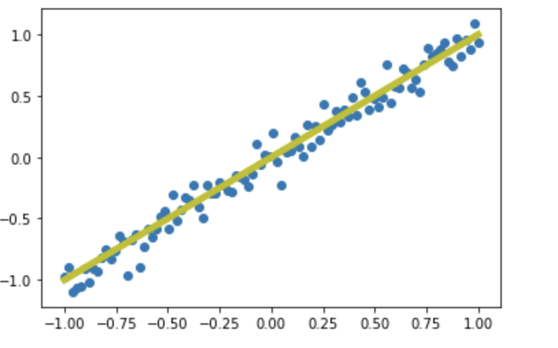

# 概述
当我们进行特征工程后，有时候会产生高维的特征空间，其中包含很多的冗余的数据，给训练带来困难，因此需要通过降维方法提升特征的表达能力，降低训练的复杂度。
**为什么需要降维**

1. 随着数据维度不断降低，数据存储所需的空间也会随之减少。
2. 低维数据有助于减少计算/训练用时。
3. 一些算法在高维度数据上容易表现不佳，降维可提高算法可用性。
4. 降维可以用删除冗余特征解决多重共线性问题。比如我们有两个变量：“一段时间内在跑步机上的耗时”和“卡路里消耗量”。这两个变量高度相关，在跑步机上花的时间越长，燃烧的卡路里自然就越多。因此，同时存储这两个数据意义不大，只需一个就够了。
5. 降维有助于数据可视化。如前所述，如果数据维度很高，可视化会变得相当困难，而绘制二维三维数据的图表非常简单。

## 1. 主成分分析(principal components analysis)
主成分分析在于找到数据中的**主成分**代替原始数据，从而达到降维的目的。
如下图是一个二维的空间中，蓝色为原始的数据分布，数据是经过去中心化的，其主成分是y=x的线段，在此黄线上，数据的分布更为分散，意味着**数据在这个方向上的方差较大**。

&emsp;在信号处理领域，信号具有较大的方差，噪声具有较小的方差，信号与噪声的比为信噪比，信噪比越大意味着数据的质量越好，因此PCA的模板是最大化投影方差。

**最大化投影方差**经过证明可能其实：协方差矩阵最大的特征向量值，最佳的投影方向就是最大特征值所对应的特征向量。证明如下：

去中心化的数据$x_1, x_2, ... x_m$，其中$x_i$是列向量，维度为数据的特征数n,向量的投影方向$w$,则$x_i$的投影坐标为$x_i^T.w$,因此投影坐标后的方差:

$$
\begin{aligned}
    D(X) &= \frac{1}{m}\sum_i^m(x_i^T.w)^2 \qquad 因为去除中心化了，均值为0\\
    &= w^T(\frac{1}{m}\sum_i^mx_ix_i^T)w \\
    &=w^T\Sigma w
\end{aligned}
$$

最大化方差:
$$
\begin{aligned}
    max \qquad &w^T\Sigma w \\
    &wTw=1 
\end{aligned}
$$
使用拉格朗日方法可求得:
$$D(x)=\lambda$$
即方差为协方差矩阵的特征值。

完整的算法流程如下:

$$
\begin{aligned}
&1. 样本均质化 x_i \\
&2. 计算协方差矩阵 xx^T\\
&3. 对协方差矩阵特征值分解 \\
&4. 取最大的d个特征值多对应的特征向量 w_1,w_2,...w_d \\
&5. 计算变化后的 x' = w^T.x
\end{aligned}
$$
通过pca算法后，将n维向量降低到d维，降维后的信息占比为:

$$\zeta = \sqrt{\frac{\sum_i^d\lambda_i^2}{\sum_i^n\lambda_i^2}}$$

如果事先不知道d的值，可以通过信息占比的阈值(如:95%)进行计算得到。

# 参考资料
- [12种降维方法终极指南（含Python代码）](https://zhuanlan.zhihu.com/p/43225794)
- 百面机器学习
- 机器学习