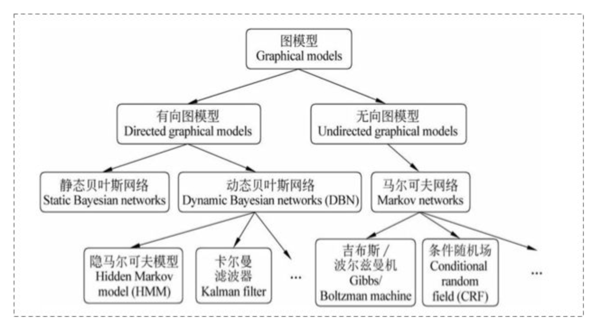
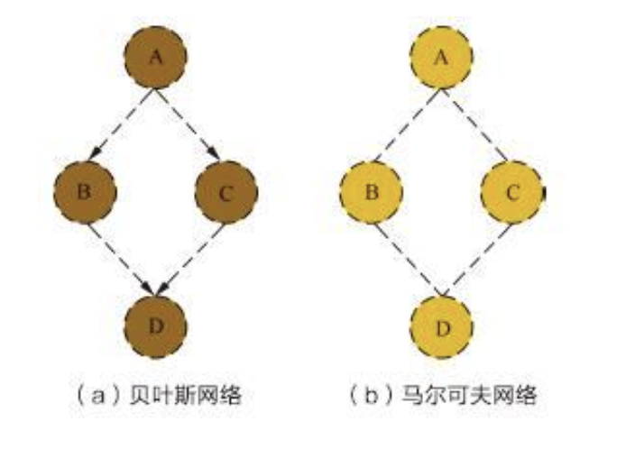
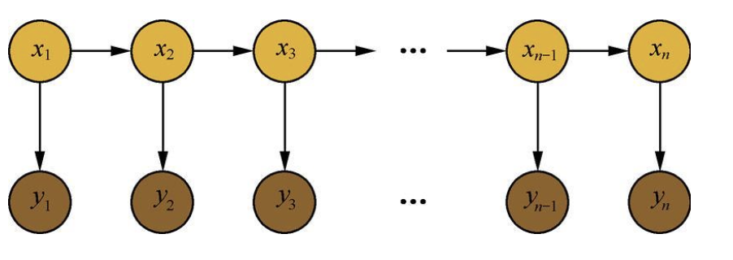
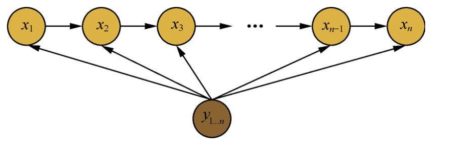
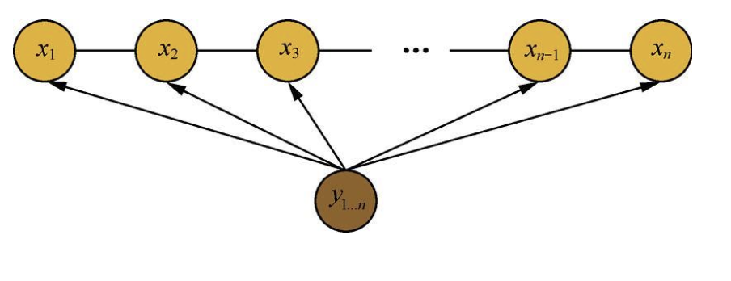

- [概率图模型](#%e6%a6%82%e7%8e%87%e5%9b%be%e6%a8%a1%e5%9e%8b)
  - [1. 概述](#1-%e6%a6%82%e8%bf%b0)
  - [2. 概率图模型中的联合概率分布](#2-%e6%a6%82%e7%8e%87%e5%9b%be%e6%a8%a1%e5%9e%8b%e4%b8%ad%e7%9a%84%e8%81%94%e5%90%88%e6%a6%82%e7%8e%87%e5%88%86%e5%b8%83)
    - [2.1 贝叶斯网络的联合概率分布](#21-%e8%b4%9d%e5%8f%b6%e6%96%af%e7%bd%91%e7%bb%9c%e7%9a%84%e8%81%94%e5%90%88%e6%a6%82%e7%8e%87%e5%88%86%e5%b8%83)
    - [2.2 马尔科夫网络的联合概率分布](#22-%e9%a9%ac%e5%b0%94%e7%a7%91%e5%a4%ab%e7%bd%91%e7%bb%9c%e7%9a%84%e8%81%94%e5%90%88%e6%a6%82%e7%8e%87%e5%88%86%e5%b8%83)
  - [3. 隐马尔可夫模型](#3-%e9%9a%90%e9%a9%ac%e5%b0%94%e5%8f%af%e5%a4%ab%e6%a8%a1%e5%9e%8b)
  - [4. 最大熵马尔科夫模型](#4-%e6%9c%80%e5%a4%a7%e7%86%b5%e9%a9%ac%e5%b0%94%e7%a7%91%e5%a4%ab%e6%a8%a1%e5%9e%8b)
  - [5. 条件随机场](#5-%e6%9d%a1%e4%bb%b6%e9%9a%8f%e6%9c%ba%e5%9c%ba)
  - [参考资料](#%e5%8f%82%e8%80%83%e8%b5%84%e6%96%99)


# 概率图模型

## 1. 概述
概率图模型(probabilistic graph model): 是用图来表达变量相关关系的概率模型。节点表示一个或一组随机变量，边表示随机变量直接的关系，节点分为观测节点和隐含节点，边分为有向边和无向边。

概率图模型分为：
```
有向图 ->  贝叶斯网络
无向图 ->  马尔科夫网络
```
更详细的分类如下图所示：



## 2. 概率图模型中的联合概率分布

下图是贝叶斯网络和马尔科夫网络的示例图，写出其联合概率分布



### 2.1 贝叶斯网络的联合概率分布

贝叶斯网络是有向图, 边的指向代表是依赖关系,根据其指向可以简单的写成联合概率分布:

$$P(A,B,C,D) = P(A)P(B|A)P(C|A)P(D|B,C)$$

### 2.2 马尔科夫网络的联合概率分布

如上图的马尔科夫网络中，对于任意有边连接的节点，则可以组成团,**最大团**即图中的极大连通子图，任意两个节点之间都有边的连接。马尔科夫网络的联合概率分布可分解:

$$P(x) = \frac{1}{Z}\prod_{Q\in{C}}U_Q(x_Q)$$
其中$C$是极大团的集合，$U_Q$是极大团对应的势函数，$Z=\sum_x\prod_{Q\in{C}}U_Q(x_Q)$为归一化因子。

势函数是$U_Q(x_Q)$是刻画变量集$X_Q$中变量直接的关系，是非负函数，且所偏好的变量取值上有较大的的函数值。

$$
\begin{aligned}
    U_Q(x_Q) &= e^{-H_Q(X_Q)} \\
    H_Q(X_Q) &= \sum_{u,v\in{Q}}\alpha_{uv}x_ux_v + \sum_{v\in{Q}} \beta x_v  \qquad 前者是两对节点，后者是一个节点关系
\end{aligned}
$$

## 3. 隐马尔可夫模型
隐马尔可夫模型可用于标注问题的统计学模型，其由隐层的马尔科夫链随机生成观测序列的过程。如下图所示的马尔科夫模型:



其中x为隐含状态，y为观测值，从图中可以看到，隐马尔科夫是简单的贝叶斯网络(有向图), 其具有两个基本的假设:

1. 齐次性假设: 即t时刻的状态仅仅依赖t-1时刻的状态
2. 观测独立假设: t时刻的观测值仅仅依赖t时刻的状态值

**马尔可夫模型的三要素**:

1. 初始状态概率分布$\pi$
2. 状态转移概率分布$A$
3. 观测概率分布$B$

隐马尔发模型可以表示为: $\lambda=(\pi, A,B)$

**隐马尔科夫的三个基本问题**

1. 概率计算: 给定$\lambda=(\pi, A,B)$,求解观测序列$Y=(y_1,y_2,...y_T)$的概率, 即计算在模型参数已经的情况下观测Y出现的概率$P(Y|\lambda)$
2. 学习问题: 已经观测序列，估计参数，即使 $P(Y|\lambda)$最大，用极大似然法估计参数
3. 预测问题: 已经模型参数和观测序列， 求解给定观测序列下最有可能的状态序列$P(X|O)$
   
## 4. 最大熵马尔科夫模型
考虑使用HMM进行序列标注是，因为HMM的两个基本的假设，其会带来**标注偏置**问题，当前的词性标注仅与前一个词性标注有关，但是实际上，在序列标注问题中，隐状态不仅和单词的观测状态相关，还和观测序列的长度，上下文相关，也就是当前词的标注信息也应该依赖于观测序列的整个长度，因此可以得到最大熵的马尔科夫模型的示例图:



最大熵模型是判别式模型，直接对后验概率进行建模:

$$P(x_{1...n|}y_{1...n}) = \prod_{i=1}^n p(x_i|x_{i-1},y_{1,...n})$$


## 5. 条件随机场

条件随机场(conditionnal random field, CRF)，是给定变量Y条件下，随机变量X的马尔科夫随机场(无向图)，线性链的条件随机场可以用于标注问题，X表示标注序列，Y是观测序列，注意条件随机场和最大熵马尔科夫模型的不同，标注序列一个是有向图，一个是无向图， 如下面的线性链条件随机场示例图：



马尔科夫网络的联合概率分布为: 
$$P(x) = \frac{1}{Z}\prod_{Q\in{C}}U_Q(x_Q)$$

当使用指数函数作为势函数时，累积变成了累加，因此:
所以CRF的条件概率分布为:

$$P(x|y) = \frac{1}{Z(y)}exp(\sum_{i,k}\lambda_k.t_k(x_{i-1},x_i,y,i) + \sum_{i,l}u_l.s_l(x_i,y,i))$$

- $Z(y) = \sum_x...$: 全局的归一化,枚举所有x的可能，解决局部归一化的标注偏置问题
- $t_k$: 转移特征函数，依赖当前和前一个位置
- $s_l$: 状态特征函数，依赖当前位置

## 参考资料
- 统计机器学习
- 百面机器学习
- 机器学习
- [概率图模型体系：HMM、MEMM、CRF](https://zhuanlan.zhihu.com/p/33397147)